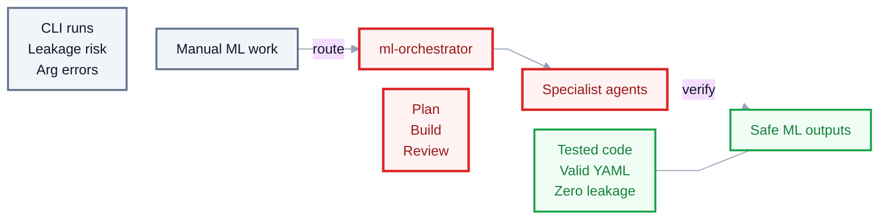
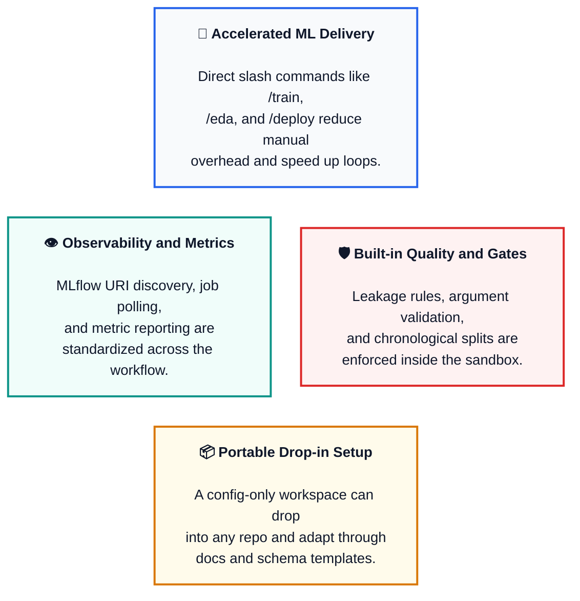
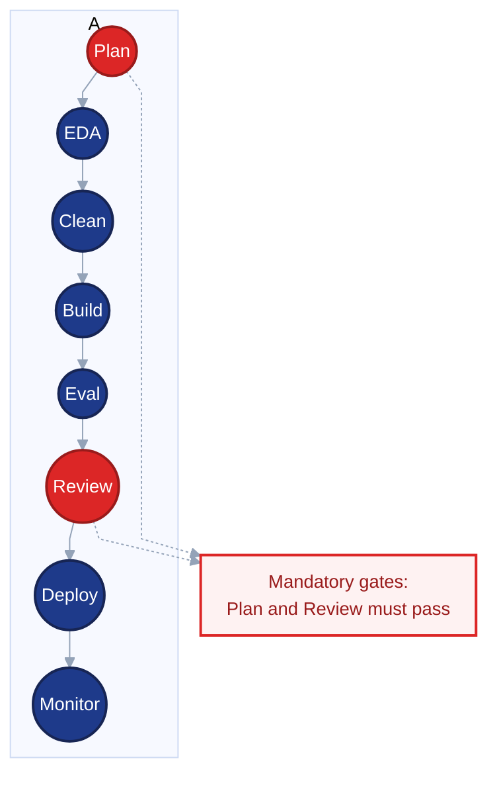
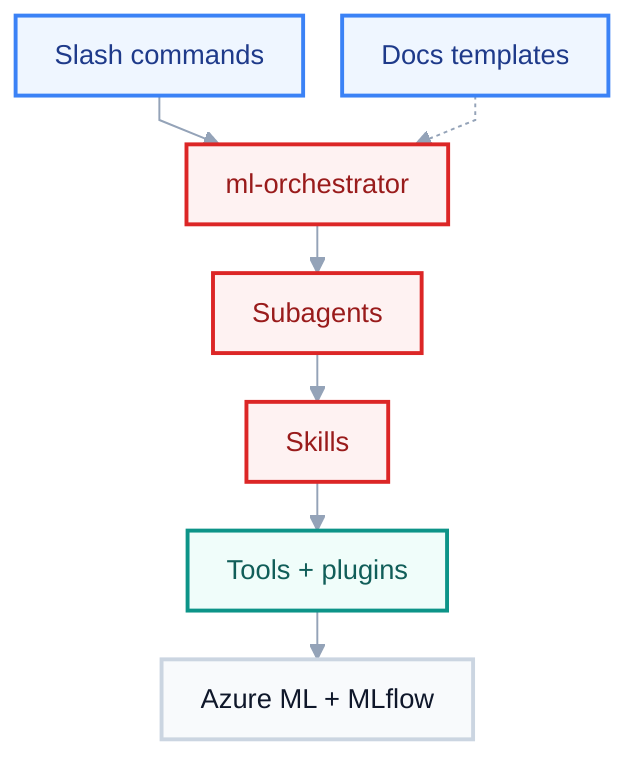
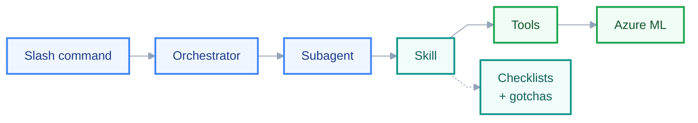
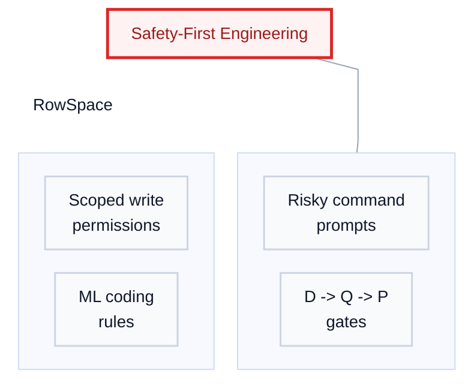
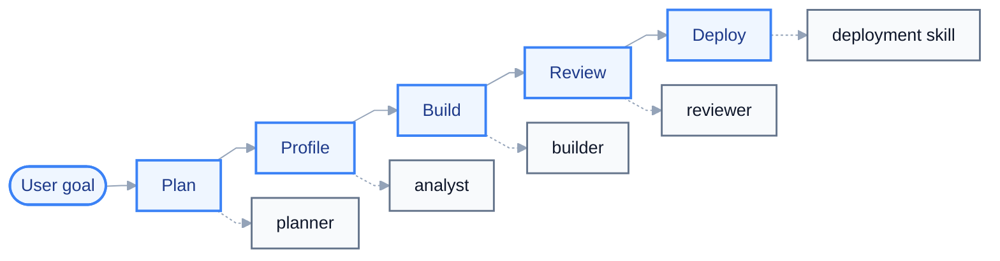
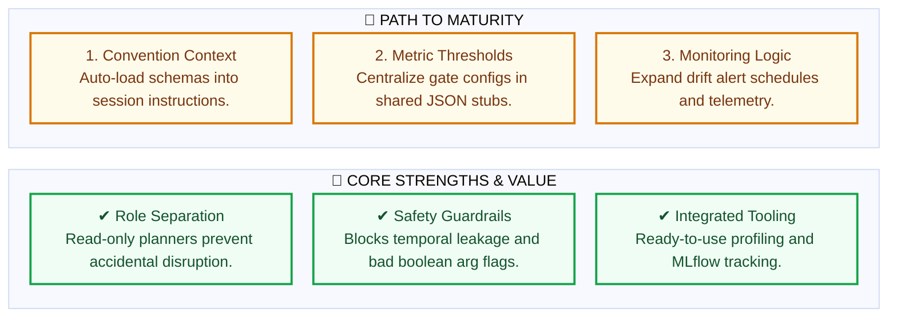

```mermaid
%%{init: {'theme':'base','themeVariables': {'fontSize':'14px','fontFamily':'Aptos, Arial, sans-serif','primaryTextColor':'#0F172A','lineColor':'#94A3B8'}, 'flowchart': {'curve': 'linear', 'nodeSpacing': 20, 'rankSpacing': 20, 'padding': 10}} }%%
graph LR
    subgraph Process ["Process"]
        direction TB
        A["User request"] --> B["Orchestrator routing"] --> C["Tests and validation"]
    end

    subgraph Deliverables ["Outputs"]
        direction TB
        D["Design Plan"]
        E["EDA report"]
        F["Tested code"]
        G["MLflow metrics"]
        H["Endpoint test"]
    end

    C -->|deliver| D
    D ~~~ E
    E ~~~ F
    F ~~~ G
    G ~~~ H

    classDef proc fill:#EFF6FF,stroke:#3B82F6,stroke-width:2px,color:#1E3A8A;
    classDef pill fill:#F0FDF4,stroke:#16A34A,stroke-width:1.5px,color:#14532D;

    class A,B,C proc;
    class D,E,F,G,H pill;
```

# ML Agentic Engineering — PPT Slide Deck Visual Designs

This document contains the visual slide layouts, diagrams, and blueprints for the PowerPoint slides. The designs below are styled based on concrete enterprise slide patterns: **Horizontal Timelines**, **Gated Flow Sandboxes**, **Card Decks**, and **Safety Highlight Callouts**.

---

## Slide 1: What is Agentic Engineering and What it does

### 📊 Visual Layout Pattern: End-to-End Sandbox Flow (Image 4 Style)
*   **Structure:** A horizontal pipeline showing how raw, risky manual tasks are ingested, compiled in an orchestrated subagent sandbox, and outputted as secure, validated assets.
*   **Color Palette:** Cold Gray (Inputs) → Warning Crimson (Sandbox Execution) → Deep Green (Target Outputs).

### 🎨 Diagram Blueprint

```text
┌────────────────────────────────────────────────────────────────────────────────────────────┐
│                                                                                            │
│   LEGACY INPUT                       ORCHESTRATOR EXECUTION                 TARGET OUTPUT  │
│  ┌──────────────────────┐  PARSE   ┌───────────────────────────┐  VALIDATE ┌─────────────┐ │
│  │ Ad-hoc CLI commands   │ ───────►│  Main Agent + Subagents   │ ─────────►│ Clean Code  │ │
│  │ Temporal leakage risk│         │  Role-specialized sandbox │           │ Zero-leakage│ │
│  │ Manual arg errors    │         │  (ml-orchestrator)        │           │ Tested YAML │ │
│  └──────────────────────┘         └───────────────────────────┘           └─────────────┘ │
│                                                                                            │
│   End-to-End Delivery: Converts manual, risk-prone pipeline commands into verified,        │
│   consistent, and safe Azure ML assets under automatic guardrails.                         │
│                                                                                            │
└────────────────────────────────────────────────────────────────────────────────────────────┘
```

### 🧜‍♂️ Mermaid Flowchart



### 📝 Slide Content

*   **Agentic Engineering:** Autonomous, role-specialized software agents executing ML workflows with guardrails.
*   **Template Scope:** Scaffolds, plans, profiles, writes code, reviews, and deploys.
*   **Core Outcomes:** Zero-leakage code, validated component parameters, and repeatable D→Q→P promotion.

---

## Slide 2: High-Level Value Proposition

### 📊 Visual Layout Pattern: Horizontal Card Grid (Image 2 Style)

*   **Structure:** 4 clean, separate cards with bold titles, visual symbols, and crisp body text arranged side-by-side or in a 2x2 grid.
*   **Color Palette:** Charcoal Blue headers, Light Slate card fills, deep Navy text.

### 🎨 Diagram Blueprint

```text
┌───────────────────────────────┐   ┌───────────────────────────────┐
│ 🚀 ACCELERATED ML DELIVERY     │   │ 🛡️ BUILT-IN QUALITY & GATES    │
│                               │   │                               │
│ Direct slash commands (/train,│   │ Strict policies for leakage,  │
│ /eda, /deploy) remove human   │   │ argument matching, and        │
│ overhead and speed up feedback│   │ chronological splits are      │
│ loops instantly.              │   │ hardcoded into the sandbox.   │
└───────────────────────────────┘   └───────────────────────────────┘
┌───────────────────────────────┐   ┌───────────────────────────────┐
│ 👁️ OBSERVABILITY & METRICS     │   │ 📦 PORTABLE DROP-IN SETUP      │
│                               │   │                               │
│ Automatic MLflow tracking URI │   │ Config-only workspace drops   │
│ discovery, training job       │   │ into any repo; schemas adapt  │
│ polling, and metrics reporting│   │ via simple Markdown files in  │
│ are fully standardized.       │   │ docs/.                        │
└───────────────────────────────┘   └───────────────────────────────┘
```

### 🧜‍♂️ Mermaid Flowchart



---

## Slide 3: The N-Phase Execution Workflow

### 📊 Visual Layout Pattern: Milestone Timeline with Callout Banner (Image 1 Style)
*   **Structure:** A continuous chronological flow with numbered milestone circles, paired with an emergency red policy-gate warning banner at the bottom.
*   **Color Palette:** Warm Gray path, Slate node fills, Bright Red warning stop.

### 🎨 Diagram Blueprint

```text
   ( 01 ) ──────── ( 02 ) ──────── ( 03 ) ──────── ( 04 ) ──────── ( 05 ) ──────── ( 06 ) ──────── ( 07 )
    Plan            EDA           Cleanse          Build         Evaluate         Review          Deploy
   Plan first,     Profile        Validate         Minimal         Track          Review code    D -> Q -> P
   define goals   datasets        raw data         pipeline       MLflow          before merge   idempotency


┌────────────────────────────────────────────────────────────────────────────────────────────────────────┐
│  🛑 MANDATORY GOVERNANCE STOPS: Experiment Planning (Phase 1) and Code Review (Phase 6) must pass      │
│     successfully before any deployment or pipeline promotion is permitted.                             │
└────────────────────────────────────────────────────────────────────────────────────────────────────────┘
```

### 🧜‍♂️ Mermaid Flowchart



---

## Slide 4: Output: What you get

### 📊 Visual Layout Pattern: Split Process-to-Artifact Layout (Image 5 Style)
*   **Structure:** Left pane shows the input source and active agent processes; right pane displays a vertical stack of clean, pill-shaped cards representing the generated deliverables.
*   **Color Palette:** Cool Blue (Process) → Forest Green (Deliverable Pillboxes).

### 🎨 Diagram Blueprint

```text
   INPUT PROCESS                           OUTCOME ARTIFACTS
  ┌─────────────────────────┐             ┌─────────────────────────────────────────────────┐
  │  User Request           │             │  📄 structured-experiment-plan.md               │
  │  (Modify feature list)  │             └─────────────────────────────────────────────────┘
  │                         │             ┌─────────────────────────────────────────────────┐
  │           ▼             │             │  📊 dataset-profiling-report.json               │
  │  ORCHESTRATOR ROUTING   │             └─────────────────────────────────────────────────┘
  │  Planner  ──► Builder   │             ┌─────────────────────────────────────────────────┐
  │  Reviewer ──► Deployer  │             │  🛠️ ruff-validated, tested-pipeline-diffs       │
  │                         │             └─────────────────────────────────────────────────┘
  │           ▼             │             ┌─────────────────────────────────────────────────┐
  │  SUCCESS CRITERIA MET   │             │  📈 mlflow-run-metrics-and-artifacts            │
  │  Unit tests: PASS       │             └─────────────────────────────────────────────────┘
  │  YAML validation: PASS  │             │  🚀 active-dev-online-endpoint-smoke-test       │
  └─────────────────────────┘             └─────────────────────────────────────────────────┘
```

### 🧜‍♂️ Mermaid Flowchart



---

## Slide 5: Architecture

### 📊 Visual Layout Pattern: Layered Tech Stack Blocks
*   **Structure:** Block diagram showing the core configuration, the orchestration layer, custom plug-ins, and how they interface with external tooling (MLflow / Azure ML).
*   **Color Palette:** Slate Blue (Control) → Teal Green (Integration).

### 🎨 Diagram Blueprint

```text
┌───────────────────────────────────────────────────────────────────────────────────────────┐
│  USER INTERFACE: Slash Commands (/eda, /train, /evaluate, /deploy, /monitor)               │
├───────────────────────────────────────────────────────────────────────────────────────────┤
│  CONTROL LAYER: Orchestrator Agent (ml-orchestrator) & Specialized Subagents              │
│  ┌───────────────────────┐ ┌───────────────────────┐ ┌──────────────────────────────────┐ │
│  │ ml-experiment-planner │ │ ml-code-builder       │ │ ml-autoresearch                  │ │
│  │ (thinking, read-only) │ │ (write-capable: edit) │ │ (modify-train-measure loop)     │ │
│  └───────────────────────┘ └───────────────────────┘ └──────────────────────────────────┘ │
├───────────────────────────────────────────────────────────────────────────────────────────┤
│  EXTENSION PLUGINS & BACKING SCRIPTS (PEP 723 / uv run)                                   │
│  ┌──────────────────────────┐ ┌──────────────────────────┐ ┌────────────────────────────┐ │
│  │ ml-env (PYTHONPATH)      │ │ ml-tools (profile, runs) │ │ ml-compaction (state save) │ │
│  └──────────────────────────┘ └──────────────────────────┘ └────────────────────────────┘ │
├───────────────────────────────────────────────────────────────────────────────────────────┤
│  ON-DEMAND SKILLS (.agents/skills/*): Cleansing, Evaluation, Deployment, Monitoring        │
├───────────────────────────────────────────────────────────────────────────────────────────┤
│  INFRASTRUCTURE INTERFACE: Azure ML CLI v2 & MLflow Tracking Workspace APIs               │
└───────────────────────────────────────────────────────────────────────────────────────────┘
```

### 🧜‍♂️ Mermaid Flowchart



---

## Slide 6: How do agents and skills interact

### 📊 Visual Layout Pattern: Dynamic Pipeline Sequence Flow (Image 4 Style)
*   **Structure:** Flowchart tracing the step-by-step resolution of a slash command, showing how the Orchestrator pairs agents with explicit on-demand skills.
*   **Color Palette:** Slate Blue (Agent Core) → Deep Teal (Skill Execution).

### 🎨 Diagram Blueprint

```text
  [ Slash Command ] ──────► [ Orchestrator ] ──────► [ Specialist Subagent ]
    e.g., /deploy            ml-orchestrator           ml-code-builder
                                                             │
                                                             ▼ Loads (On-Demand)
                                                     ┌────────────────────────┐
                                                     │ ml-deployment Skill    │
                                                     │ - Checklists & gotchas │
                                                     │ - scripts/deploy.py    │
                                                     └────────────────────────┘
                                                             │
                                                             ▼ Executes
                                                     [ Azure ML CLI v2 / Tools ]
```

### 🧜‍♂️ Mermaid Flowchart



---

## Slide 7: Key Guardrails & System Safety

### 📊 Visual Layout Pattern: Warning Banner with Checklists (Image 3 Style)
*   **Structure:** Highlighted red banner with lock icon for "Safety-First Engineering", followed by 4 detailed, checkmarked items in columns below.
*   **Color Palette:** Alert Crimson (Banner) → Teal & Navy (Checklist items).

### 🎨 Diagram Blueprint

```text
┌───────────────────────────────────────────────────────────────────────────────────────────┐
│  🔒 Safety-First Engineering                                                              │
│  Automated sandboxing and guardrails ensure agents operate strictly in safe boundaries.   │
└───────────────────────────────────────────────────────────────────────────────────────────┘

  ✔ SCOPED WRITE PERMISSIONS                  ✔ ENFORCED CODING PATTERNS
    Only Builder & Autoresearch can edit        str_to_bool for booleans, Managed Identity,
    files; Orchestrator, Planner, and Analyst   no hardcoded tracking URIs, chronological
    are locked to read-only mode.               temporal leakage guards.

  ✔ RISKY COMMAND FILTERS                     ✔ GATED PROMOTION FLOWS
    High-risk commands (rm, git push/reset,     D -> Q -> P environments cannot be skipped;
    az ml) are caught by opencode.json          scoring scripts must be tested locally
    and trigger manual human prompts.           with sample payloads first.
```

### 🧜‍♂️ Mermaid Flowchart



---

## Slide 8: ML Agentic Engineering Workflow

### 📊 Visual Layout Pattern: Flow Timeline with Parallel Channels
*   **Structure:** Step-by-step user session showing the handoffs from design, to sandbox validation, to deployment.
*   **Color Palette:** Indigo (User-focused) → Green (Validated output).

### 🎨 Diagram Blueprint

```text
  [ User Goal ]
       │
       ▼
  Phase 1: Design  ──────► ml-experiment-planner produces design specification
       │
       ▼
  Phase 2: Profile ──────► ml-data-analyst profiles dataset for leakage risks
       │
       ▼
  Phase 3: Build   ──────► ml-code-builder writes pipeline code and runs unit tests
       │
       ▼
  Phase 4: Review  ──────► ml-code-reviewer flags CRITICAL/WARNING issues
       │
       ▼
  Phase 5: Deploy  ──────► ml-deployment promotes model to D -> Q -> P
```

### 🧜‍♂️ Mermaid Flowchart



---

## Slide 2: Summary

### 📊 Visual Layout Pattern: Side-by-Side Card Deck (Image 2 Style)
*   **Structure:** Two massive, clean, vertical panels displaying the "Core Strengths" and the "Path to Maturity" respectively.
*   **Color Palette:** Soft Blue-Green (Value) → Soft Amber (Future Improvements).

### 🎨 Diagram Blueprint

```text
  ┌─────────────────────────────────────────┐   ┌─────────────────────────────────────────┐
  │  🌟 WHAT WORKS: STRENGTHS & VALUE       │   │  🚀 NEXT STEPS: AREAS TO IMPROVE        │
  ├─────────────────────────────────────────┤   ├─────────────────────────────────────────┤
  │                                         │   │                                         │
  │  ✔ Separation of Concerns: Read-only    │   │  1. In-Session Conventions: Auto-load   │
  │    planners and analysts prevent        │   │     docs/ schemas into opencode.json    │
  │    accidental codebase disruption.      │   │     instructions key.                   │
  │                                         │   │                                         │
  │  ✔ Hardcoded Guardrails: Key ML pitfalls│   │  2. Evaluation Gates: Standardize metric│
  │    (temporal leakage, bad booleans)     │   │     threshold configs in a shared JSON. │
  │    are blocked automatically.           │   │                                         │
  │                                         │   │  3. Expand Monitoring: Add baseline     │
  │  ✔ Out-of-the-Box Tooling: Profile and  │   │     drift schedules and alerting rules  │
  │    MLflow utilities speed up loop.      │   │     as a downstream starter asset.      │
  │                                         │   │                                         │
  └─────────────────────────────────────────┘   └─────────────────────────────────────────┘
```

### 🧜‍♂️ Mermaid Flowchart



---
*Generated based on OpenCode ML agentic configurations.*
